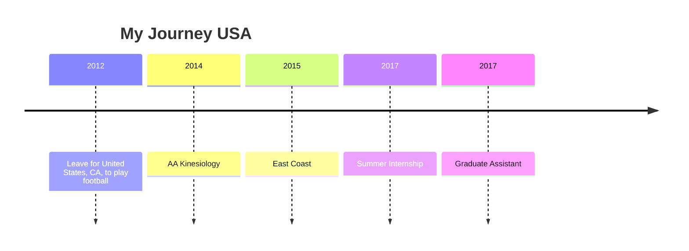
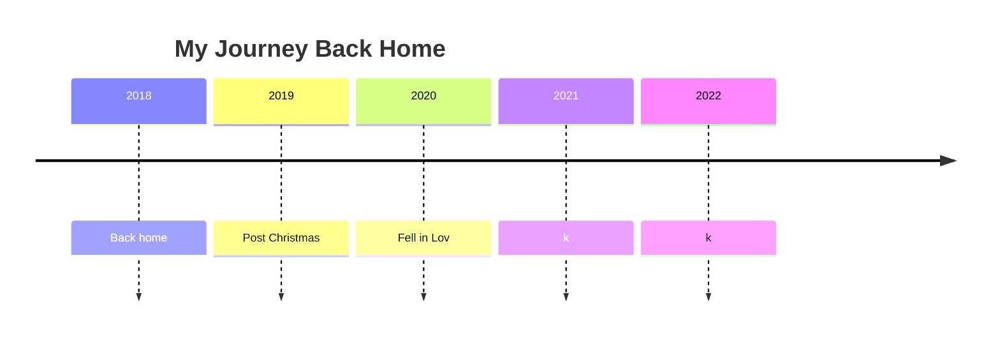
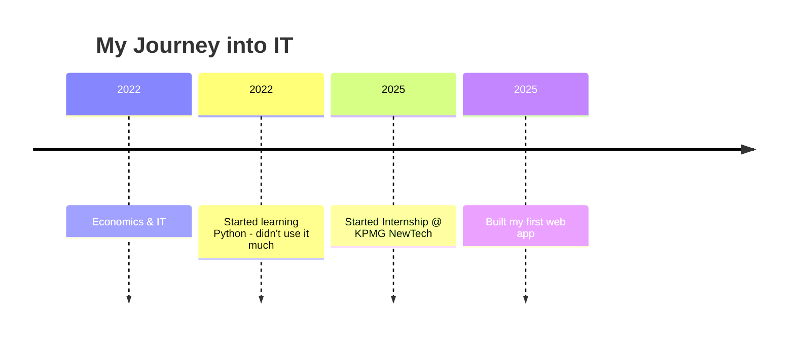

# Hola Hulk, Thor, Walliiee or whatever suit you 👋

If you're reading this, it's too late.
**Great Listener, Always Curious, Challenge Seeker**

Prior to December 2024, I hadn't built anything and only had a foundational knowledge of software development and design.
Now I build stuff and I learn every darn day - and it's exactly how I want it to be.

> “Much to learn, he still has.”  
> – *Yoda*

## ✨ About Me
My Age: 32 years, 7 months, 12 days, 1414 minutes
- Father and a great friend and a hint of too much empathy, that leads me to want to solve all of the worlds problems and help everybody I meet.
- Oh and then I like to learn.
- I like to explore.
- I like challenges.
- When I start something I go all in. I listen, read and do until I understand and then I keep iterating on that.

## 🔧 Languages & Tools
not the best not the worst 
- **Languages:** Mostly , a bit of    and . Also  but really no thank you...
- **Frameworks & Libraries:** FE:  most, bit of . Most , a bit of 
- **Tools:** , 
- **IDE:**  & 
- **Other Interests:** Staying healthy in mind and body. Football, American Football most but other sports have a wee bit of interest as well. GenAI because damn, can we make some awesome things happen!
- **80/20 Principle:** Most things in life you don't have to master more than 80% and you can do it with 20% of the effort. Pick one MAX two things to fully focus on but the rest should be 80/20. For me that goes for making great coffee and sour dough, the rest is only for the margins and for specialists.

> “Master of one, Jack of many.”  
> – *ME*

## 🚀 Projects
- **Markets Models**
  6 different RAG models with specified system prompts and parameters.  

- **Heatmap Project**
  Can't release it yet. Part of an internal project.
  Application for visualizing GenAI conversational usage (Claude and ChatGPT for now), in a calendar heatmap using Plotly Calplot, also analyzing usage data individually and combined.
  Data processing on a wide range of conversational data to embed and cluster, to be able to classify conversational topics upon upload.

### 🔭 I’m currently working on: ###

- **Fitness Community App**
  Work in progress using Loveable

- **Small Cap Analyzer Blog**
  Same

- 🌱 I’m currently learning: How to build agents
- ⚡ Fun fact: Before going into IT, I took a BA in the US and when I got back to Denmark outdoorish

---

*I'm here, so are you! Why not make the most of it? Help me grow*

## Congrats on being number

