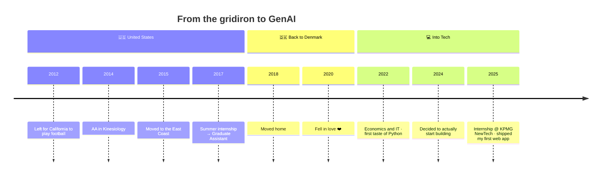

<!-- Banner -->

<!-- Animated typing header -->

**🧠 GenAI / RAG builder · 🏗️ shipping fitness + fintech side projects · ☕ coffee & sourdough at 100%, everything else at 80%**

 

<!-- Contact / socials -->

 

<!-- Flavor / "powered by" badges -->

<!-- TODO: add your LinkedIn handle below, then uncomment -->
<!--  -->

---

> *If you're reading this, it's too late.*

Prior to December 2024, I hadn't built anything — only a foundational knowledge of software development and design.
Now I build stuff and I learn every darn day, and it's exactly how I want it to be.

> “Much to learn, he still has.”
> – *Yoda*

## ✨ About Me

🎂 **Age:** <!--START_AGE-->32 years, 11 months, 6 days, 427 minutes<!--END_AGE--> &nbsp;↑ auto-updated daily by a GitHub Action, because why round? 🤖

- 👨‍👧 Father, good friend, and carrier of *a hint of too much empathy* — which makes me want to solve all of the world's problems and help everybody I meet.
- 🧭 I like to **learn**, I like to **explore**, and I like a good **challenge**.
- 🔁 When I start something I go all in — I listen, read and do until I understand, then I keep iterating.

> **The 80/20 Principle:** Most things in life you don't need to master beyond 80%, and you can get there with 20% of the effort. Pick **one, max two** things to fully focus on; the rest stay at 80/20. For me the 100% goes to great coffee and sourdough — the rest is for the margins and the specialists.

> “Master of one, Jack of many.”
> – *ME*

## 🔧 Languages & Tools

not the best, not the worst — just shipping

**Languages**

 …but really, no thank you

**Frontend**

**Backend**

**Tools & Environment**

**Also into:** staying healthy in mind and body 🏃 · football & American football 🏈 · and GenAI — because *damn*, can we make some awesome things happen.

## 🚀 What I'm Building

| Project | What it is | Status |
| --- | --- | --- |
| **Markets Models** | 6 RAG models, each with tailored system prompts & parameters | ✅ Built |
| **Heatmap Project** | Visualizing GenAI conversation usage (Claude + ChatGPT) on a calendar heatmap with Plotly Calplot — plus embedding & clustering to classify conversation topics on upload | 🔒 Internal |
| **[Challenger Crew](https://www.challenger-crew.com/)** | Fitness community app for training & accountability | 🟢 Live |
| **Small Cap Analyzer Blog** | Analysis + writing on small-cap markets | 🚧 In progress |

- 🌱 **Currently learning:** how to build agents
- ⚡ **Fun fact:** before going into IT I took a degree in the US — and came back to Denmark with a serious outdoor habit and a love for the game.

## 🗺️ My Journey

```mermaid
timeline
  title From the gridiron to GenAI
  section 🇺🇸 United States
    2012 : Left for California to play football
    2014 : AA in Kinesiology
    2015 : Moved to the East Coast
    2017 : Summer internship → Graduate Assistant
  section 🇩🇰 Back to Denmark
    2018 : Moved home
    2020 : Fell in love ❤️
  section 💻 Into Tech
    2022 : Economics and IT · first taste of Python
    2024 : Decided to actually start building
    2025 : Internship @ KPMG NewTech · shipped my first web app
```

## 🃏 Dad Joke of the Day

<em><!--START_DADJOKE-->What do you call a magician who has lost their magic? Ian.<!--END_DADJOKE--></em>

↑ a fresh one served daily by a GitHub Action 🤖 — sorry in advance

## 📊 GitHub in Numbers

<!-- Contribution activity over time -->

<!-- Achievement trophies -->

<!-- Contribution snake — activates after the "Generate Snake" Action runs once -->
<picture>
  <source media="(prefers-color-scheme: dark)" srcset="https://raw.githubusercontent.com/Walliiee/Walliiee/output/github-snake-dark.svg">
  <source media="(prefers-color-scheme: light)" srcset="https://raw.githubusercontent.com/Walliiee/Walliiee/output/github-snake.svg">
  
</picture>

---

*I'm here, so are you! Why not make the most of it? Help me grow.* 🌱

**You're visitor number**

